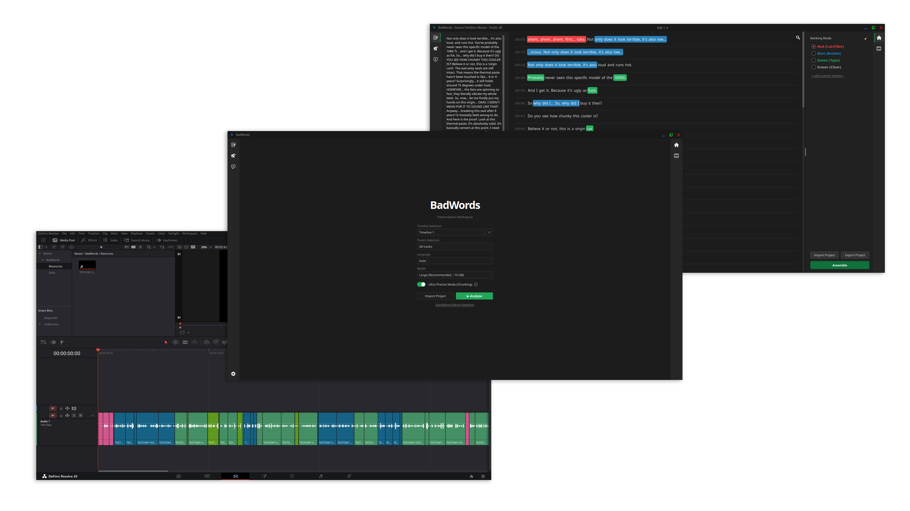
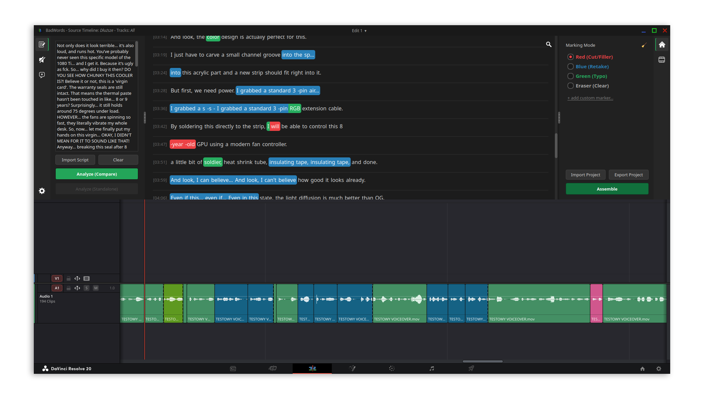
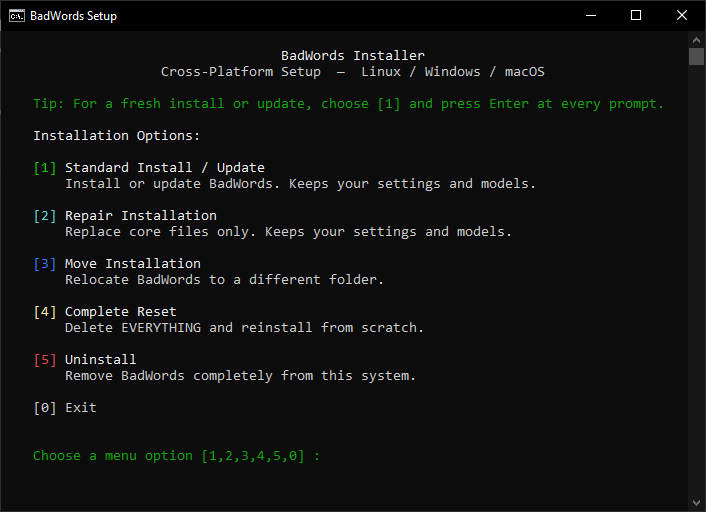

<h1 align="center">BadWords</h1>
<h3 align="center">Cleaner Timelines, Faster. Simpler Rough-Cutting for DaVinci Resolve.</h3>

<p align="center">
  
</p>

<p align="center">
  <a href="#-windows"></a>
  <a href="#-windows"></a>
  &nbsp;&nbsp;&nbsp;&nbsp;
  <a href="#-macos"></a>
  <a href="#-macos"></a>
  &nbsp;&nbsp;&nbsp;&nbsp;
  <a href="#-linux-any-distro"></a>
  <a href="#-linux-any-distro"></a>
</p>

---

## 💡 What is it?

**BadWords** is a plugin-app for DaVinci Resolve built for anyone dealing with dialogue-heavy footage (podcasts, talking heads, gameplays). Instead of scrubbing through hours of audio on a timeline to find silences, retakes, and filler words, BadWords transforms your workflow into an easy text-editing experience.

It uses local AI (Faster-Whisper) to give you a full transcript of your audio. You can then color-code mistakes, compare it against your original script, and with one click, send the processed timeline back to Resolve — complete with markers and cuts. 

BadWords does **80% of the tedious work for you** (cutting tight silences, marking obvious bloopers), leaving only the final polishing to you.

## ⚙️ How it works

1. **Select & Transcribe:** Launch BadWords directly from Resolve, pick your audio tracks, and hit Analyze. The AI transcribes everything.
2. **Edit like a Document:** Your audio opens as text in an IDE-inspired editor. You (or the algorithm) can paint words with different colors:
   * 🔴 **Red** — Filler words / obvious mistakes to remove
   * 🔵 **Blue** — Retakes / duplicates
   * 🟢 **Green** — Typos / close matches
3. **Compare to Script:** If you have an original script, BadWords can automatically compare it against your transcript to highlight missing lines and deviations. *(Standalone analysis without a script is currently still in the works!)*
4. **Assemble Timeline:** Once you're done playing with the text, hit Assemble. BadWords automatically generates a **brand new, clean timeline** inside Resolve with all your cuts and color markers applied perfectly.

<p align="center">
  
</p>

## ✨ Why use BadWords?

- **Massive Time Saver:** Turns hours of manual clicking and scrubbing into a quick visual review. The silence detection alone is highly precise and will save you tons of time.
- **100% Local & Private:** No cloud processing, no subscriptions, no data harvesting. All processing happens entirely on your own hardware (except for optional, anonymous telemetry).
- **Non-Destructive Versioning:** BadWords never edits your original timeline. Every time you click "Assemble", it creates a new timeline copy.
- **Timeline Heatmap Approach:** AI isn't perfect; it might miss tiny stutters. That's why BadWords is designed to give you an overview (a "heatmap") of your clip qualities using Resolve's native colorful markers, letting you finalize the cuts manually exactly where needed.

---

## 🔥 What's New in 3.0?

Version 3.0 is the biggest update yet — completely rewriting the core of the app:
* **IDE-Inspired Interface:** I ditched the simple Tkinter UI for a powerful `PySide6` interface, directly inspired by tools like VS Code. Enjoy custom sidebars, completely draggable and readjustable panels, and a sleek settings menu.
* **EXTREME Precision:** Version 3.0 comes with Ultra Precise Mode which uses chunking feature to NOT MISS A SINGLE STUTTER. The time of transcription can get higher
* **Custom Markers:** Create your own named markers from 11 available DaVinci Resolve colors to categorize clips exactly how you want.

**...and this is just the beginning.** The new UI is still heavily in development, and future updates are planned to include side-by-side script comparison views, ultra-precise captions, and standalone filler word detection without needing a base script.

---

## 🛠️ Installation & Setup

I know that installing plugins can sometimes be a headache. That's why I made BadWords use a **unified, one-click installation process** that looks and works exactly the same on every operating system. You don't need to manually download zip files, configure paths, or install dependencies.

### 📝 The Installation Process

1. **Copy the command** for your specific operating system from the section below.
2. **Paste the command** into your terminal (PowerShell on Windows, Terminal on macOS/Linux) and press **Enter**.
3. Wait for the script to prepare the environment. The following BadWords Setup menu will appear:

<p align="center">
  
</p>

4. **Press `1`** for the standard installation.
5. Provide a path where you want BadWords (~15GB) and your chosen AI models to be installed, or simply **press Enter** to use the default location.
6. Wait for the download to complete (It will take a while because its downloading heavy libraries), and once you see the success message, you can safely **close the terminal**. 

> **Note:** As you can see on the screenshot above, the installer menu gives you 4 other options besides standard installation. In the future, you can use the exact same command to Update your app, Repair broken files, Move the installation to another drive, or completely Uninstall BadWords!

---

### 🚀 Option 1: Automated Terminal Command (Recommended)
The absolute easiest way to start the setup. It securely downloads and runs the open-source installer script directly from this repository.

> 🔍 *Note: The commands below only prepare your system before running the main installer. [You can view the core setup.py script here](https://github.com/veritus-git/BadWords/blob/main/setupfiles/setup.py).*

<br>

#### 🪟 Windows
Open the Start Menu, search for **PowerShell**, open it, paste the following command, and press **Enter**:

```powershell
irm "https://raw.githubusercontent.com/veritus-git/BadWords/main/setupfiles/windows-setup.ps1" | iex
```


<br>

#### 🍎 macOS
> [!WARNING]
> BadWords will not work with the Mac App Store version of DaVinci Resolve. Re-install from the [official website](https://www.blackmagicdesign.com/products/davinciresolve/) if needed.


Open the **Terminal** app (search with Spotlight `Cmd + Space`), paste the following command, and press **Enter**:

```bash
curl -fsSL "https://raw.githubusercontent.com/veritus-git/BadWords/main/setupfiles/mac-setup.sh" | bash
```


<br>

#### 🐧 Linux (Any Distro)
Open your terminal, paste the following command, and press **Enter**:

```bash
curl -fsSL "https://raw.githubusercontent.com/veritus-git/BadWords/main/setupfiles/linux-setup.sh" | bash
```

<br>

---

### 📦 Option 2: Manual Install
Don't like pasting terminal commands? I completely understand! You can run the setup manually:
1. Go to the [Releases page](https://github.com/veritus-git/BadWords/releases/latest) and download the Source Code `.zip`.
2. Extract the folder somewhere on your drive.
3. Open the `setupfiles` folder inside the extracted directory.
4. Run the setup script dedicated to your OS.

---

### 🛡️ Wait, are these terminal commands actually safe?
Pasting `curl` or `iex` commands can trigger red flags for cautious users. Here is why BadWords uses them and why you don't need to worry:

* **Zero System Interference:** These commands **do not require Administrator / root privileges** (no `sudo` or "Run as Administrator" needed). Everything is downloaded into a safe, isolated directory in your local user folder.
* **Always Up-to-Date:** Fetching the script directly from GitHub ensures you are always running the latest version of the installer, so you don't have to deal with broken links or outdated dependencies.
* **100% Transparent:** The commands point directly to plain-text files hosted right here on GitHub. You can click the *View script* links above to read every single line of code before pressing Enter!

---

## 🎬 Launching in DaVinci Resolve

1. Open DaVinci Resolve and navigate to a project timeline.
2. At the very top menu bar, click on **Workspace** → **Scripts** → **BadWords**.

> **Important:** Your *first launch*, *first transcription*, and *first analysis* will take considerably longer than usual as the AI model completes its initial setup for your hardware. **All subsequent transcriptions are much faster.** <br>
> **Note:** Whisper models perform best with English and major European languages. Other languages are supported but might yield lower precision.

---

## 📋 Requirements
- **App:** DaVinci Resolve (Free or Studio) — **Not from the App Store!**
- **Hardware:** NVIDIA GPU highly recommended for acceleration (CPU-only mode is available).
- **Disk Space:** ~15GB free space for the app, plus 1–10GB depending on your chosen AI models.

---

## 🎬 A little about me & the project

Hi! I am Simon - the 17 year old solo-developer of BadWords. This project started totally randomly. It wasn't planned, it wasn't supposed to become a full-on program. Heck! It wasn't supposed to even leave my computer... but somehow it became the biggest and most advanced project I've made.
It's probably not the best, the fastest, the cleanest, or the most useful thing you'll see... but while making it, I realized that it could actually be useful not only to me - but for many others.
So... I made it for everyone.
It is still in development, it probably has a lot of bugs, "holes", crashes on edge-cases and unoptimized functions. So if you ever stumble upon any problems - feel free to open an Issue or contact me directly.
Just by using BadWords and sending feedback, you are contributing to this project's community :)

**Support the Project!**  
If BadWords saved you even a bit of time, consider buying me a coffee. It helps me maintain the project between school and life!

<a href="https://buymeacoffee.com/badwords" target="_blank"></a>

---

## 🤝 Contribute & Contact

This is an open-source project. Feel free to open issues or pull requests to improve the tool!

[](https://www.reddit.com/message/compose/?to=KoxSwYT)
[](mailto:badwords.git@gmail.com)

[License (MIT)](LICENSE)  
*Note: This tool is not affiliated with Blackmagic Design. Use at your own risk.*
