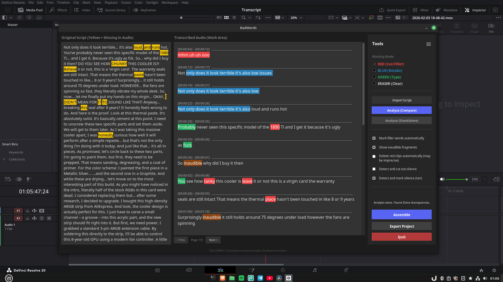
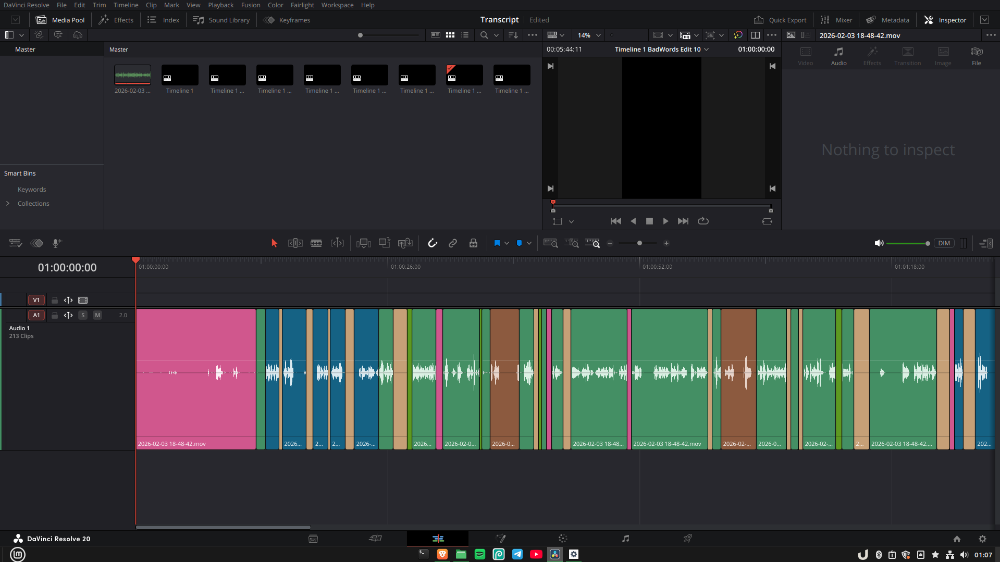

<h1 align="center">BadWords</h1>
<h3 align="center">Cleaner Timelines, Faster. Simpler Rough-Cutting for DaVinci Resolve.</h3>

<p align="center">
  
</p>

<p align="center">
  <a href="#-windows"></a>
  <a href="#-windows"></a>
  <br><br>
  <a href="#-linux-any-distro"></a>
  <a href="#-linux-any-distro"></a>
  <br><br>
  <a></a>
  <a></a>
</p>

---

## 💡 What is it?

**BadWords** is a plugin-app for DaVinci Resolve built for anyone dealing with dialogue-heavy footage (podcasts, talking heads, gameplays). Instead of scrubbing through hours of video on a timeline to find silences, retakes, and filler words, BadWords transforms your workflow into an easy interactive experience.

It uses local AI (Faster-Whisper) to give you a full transcript of your audio. You can then review the cuts, remove silences and filler words, and with one click, send the processed timeline back to Resolve — complete with markers and cuts. 

BadWords does **80% of the tedious work for you** (cutting tight silences, marking obvious bloopers), leaving the final polishing to you.

## ⚙️ How it works

1. **Select & Transcribe:** Launch BadWords directly from Resolve, pick your audio tracks, and hit Analyze. The AI transcribes everything.
2. **Interactive Review:** Review transcript before assembling it, find deviations, check badtakes and remove silence & filler words (emm, ahh)
3. **Assemble Timeline:** Once you're done reviewing, hit Assemble. BadWords automatically generates a **brand new, clean timeline** inside Resolve with all your cuts and color markers applied perfectly.

<p align="center">
  
</p>

## ✨ Why use BadWords?

- **Massive Time Saver:** Turns hours of manual clicking and scrubbing into a quick visual review. The silence detection alone is highly precise and will save you tons of time.
- **100% Local & Private:** No cloud processing, no subscriptions, no data harvesting. All processing happens entirely on your own hardware (except for optional, anonymous telemetry).
- **Non-Destructive Versioning:** BadWords never edits your original timeline. Every time you click "Assemble", it creates a new timeline copy.
- **Timeline Heatmap Approach:** AI isn't perfect; it might miss tiny stutters. That's why BadWords is designed to give you an overview (a "heatmap") of your clip qualities using Resolve's native colorful markers, letting you finalize the cuts manually exactly where needed.

---

## 🛠️ What's new in 2.0.3?

- **Percentage Progress Bar:** Transcription now shows a precise, real-time percentage progress bar so you always know exactly how far along Whisper is.
- **Full Uninstallers:** Both Windows and Linux now ship with complete, scorched-earth uninstallers that cleanly remove all associated files, hidden folders, and registry entries — no leftovers.
- **Linux Install Path Selection:** The Linux installer now lets you choose a custom installation path instead of forcing a single fixed location.
- **Geolocation opt-out in Telemetry:** You can now disable geolocation in the optional telemetry ping. Opting out strips all location data from the anonymous install/update signal.
- **Subprocess stability fixes:** Resolved edge-case crashes in background subprocess handling for more reliable transcription runs.
- **Installer optimisations:** Both installers are smarter — the Linux script skips redundant PyTorch downloads when updating, and the GPU acceleration mode is auto-detected on updates so you don't have to pick it again.

---

## 📋 Requirements
- **App:** DaVinci Resolve (Free or Studio)
- **Hardware:** NVIDIA GPU highly recommended for acceleration (CPU-only mode is available).
- **Disk Space:** ~15GB free space for the app, plus 1–10GB depending on your chosen AI models.

---

## 🛠️ Installation & Setup

> **Note:** The installation process may take a while depending on your internet connection. It downloads ~15GB of essential AI libraries and UI components required to run entirely offline. Internet is also required for first analysis to download chosen AI Whisper model

### 🪟 Windows
Simply download the standard installer and follow the process.
1. Download the latest `.exe` from [GitHub Releases](https://github.com/veritus-git/BadWords/releases/latest) (or if you encounter issues [GitLab Releases](https://gitlab.com/badwords/BadWords/-/releases/permalink/latest)).
2. Run the executable and follow the on-screen instructions.

### 🐧 Linux (Any Distro, Latest Version)
For the fastest setup, you can use this one-line installer. Open your terminal and run:

```bash
# From GitHub
/bin/bash -c "$(curl -fsSL https://raw.githubusercontent.com/veritus-git/BadWords/main/setupfiles/linux-setup.sh)"
```

```bash
# Or from GitLab if you encounter issues
/bin/bash -c "$(curl -fsSL https://gitlab.com/badwords/BadWords/-/raw/main/setupfiles/linux-setup.sh)"
```

**Terminal Installation Steps:**
1. After pasting the command, a menu with 5 options will appear in your terminal.
2. Press **Enter** to proceed with the default installation.
3. You will be asked for the target installation path. Type your desired path or just press **Enter** to use the default location for the app and its models.

---

**Older Versions (ZIP Archive) / Manual Download:**
If you want to install a specific older version, you must download the `.zip` archive from [Releases](https://github.com/veritus-git/BadWords/releases) instead of using the commands above.
1. Download and extract the `.zip` archive.
2. Open the extracted folder in your terminal.
3. Make the script executable: `chmod +x linux_setup.sh`
4. Run the installer: `./linux_setup.sh`
5. Follow the instructions in "Terminal Installation Steps" above.

---

## 🎬 Launching in DaVinci Resolve

1. Open DaVinci Resolve and navigate to a project timeline.
2. At the very top menu bar, click on **Workspace** → **Scripts** → **BadWords**.

> **Important:** Your *first launch*, *first transcription*, and *first analysis* will take considerably longer than usual as the AI model completes its initial setup for your hardware. **All subsequent transcriptions are much faster.**

> **Note:** Whisper models perform best with English and major European languages. Other languages are supported but might yield lower precision.

---

## 🎬 A little about me & the project

Hi! I am Simon - the 17 year old solo-developer of BadWords. This project started totally randomly. It wasn't planned, it wasn't supposed to become a full-on program. Heck! It wasn't supposed to even leave my computer... but somehow it became the biggest and most advanced project I've made.
It's probably not the best, the fastest, the cleanest, or the most useful thing you'll see... but while making it, I realized that it could actually be useful not only to me - but for many others.
So... I made it for everyone.
It is still in development, it probably has a lot of bugs, "holes", crashes on edge-cases and unoptimized functions. So if you ever stumble upon any problems - feel free to open an Issue or contact me directly.
Just by using BadWords and sending feedback, you are contributing to this project's community :)

**Support the Project!**  
If BadWords saved you even a bit of time, consider buying me a coffee. It helps me maintain the project between school and life!

<a href="https://buymeacoffee.com/badwords" target="_blank"></a>

---

## 🤝 Contribute & Contact

This is an open-source project. Feel free to open issues or pull requests to improve the tool!

[](https://www.reddit.com/message/compose/?to=KoxSwYT)
[](mailto:badwords.git@gmail.com)

[License (MIT)](LICENSE)  
*Note: This tool is not affiliated with Blackmagic Design. Use at your own risk.*
