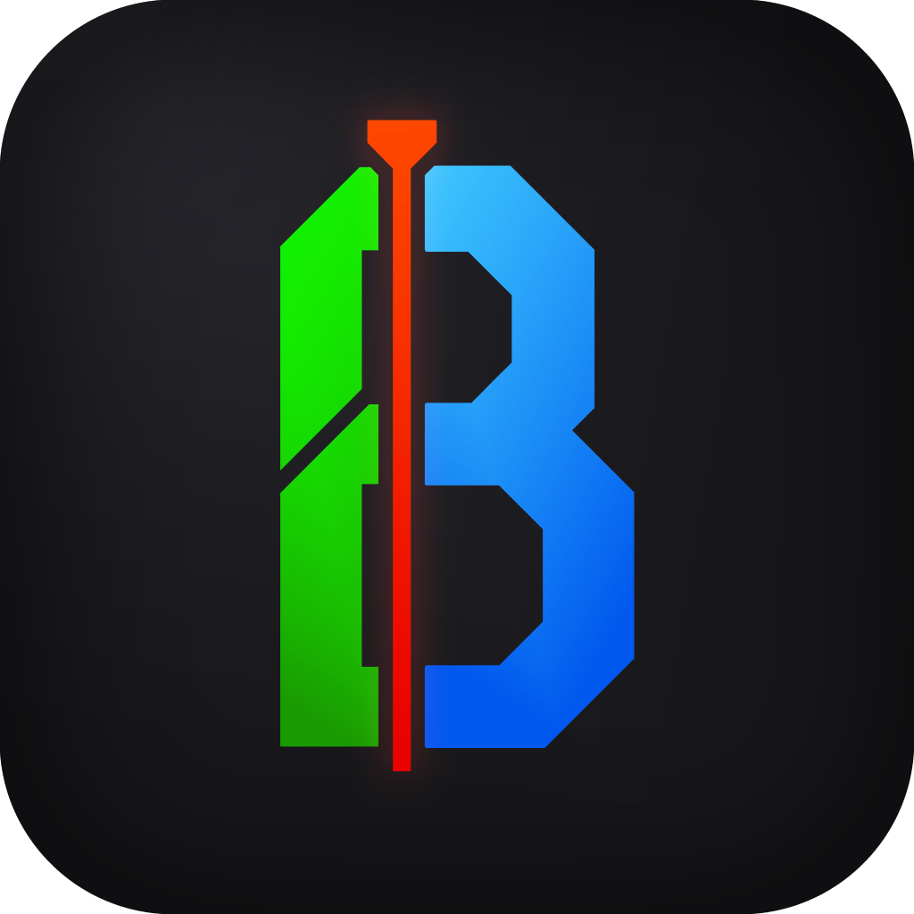
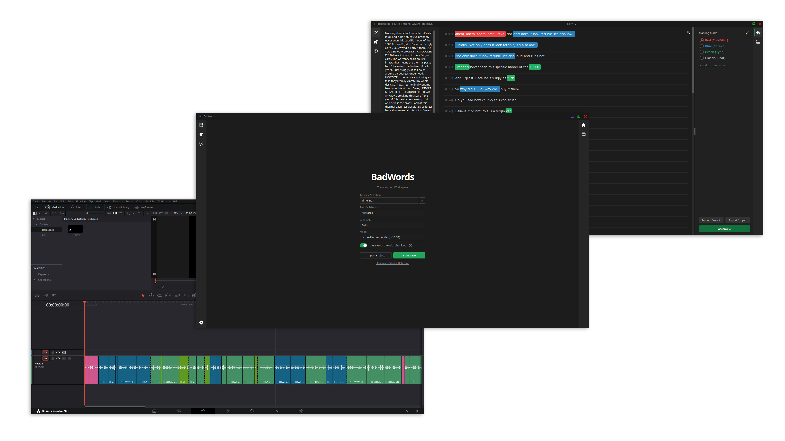
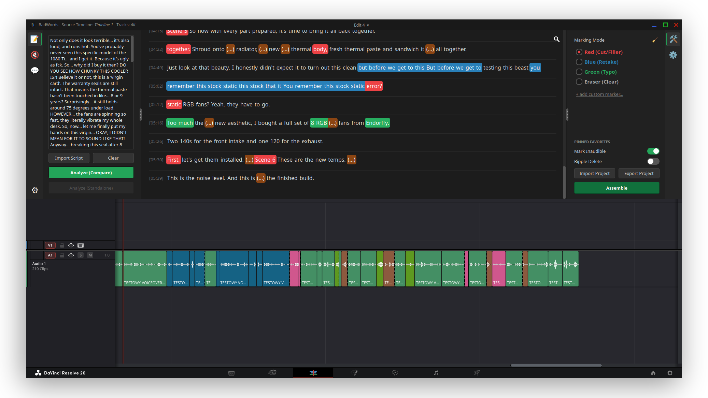
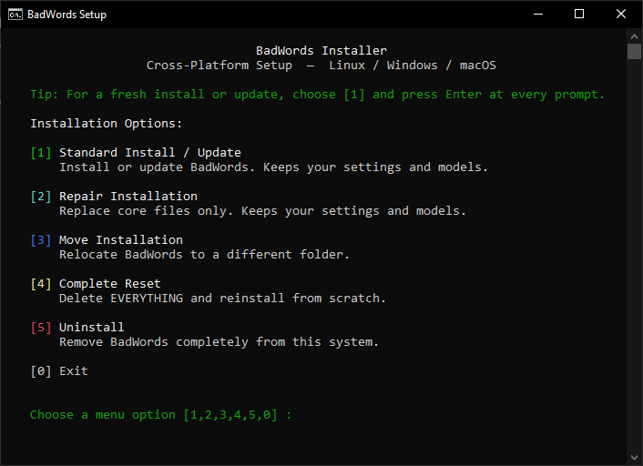

# &nbsp; BadWords
**Cleaner Timelines, Faster. Simpler Rough-Cutting for DaVinci Resolve.**

<br>

<p align="center">
  
</p>

<br>

<p align="center">
  <a href="#windows"></a>
  &nbsp;&nbsp;&nbsp;&nbsp;
  <a href="#macos"></a>
  &nbsp;&nbsp;&nbsp;&nbsp;
  <a href="#linux-any-distro"></a>
</p>

<p align="center">
  <a href="#installation"></a>
  &nbsp;&nbsp;&nbsp;&nbsp;
  <a href="docs/USER_GUIDE.md"></a>
  &nbsp;&nbsp;&nbsp;&nbsp;
  <a href="https://buymeacoffee.com/badwords" target="_blank"></a>
</p>

<br>

##  What is it?

**BadWords** is a plugin-app for DaVinci Resolve built for anyone dealing with dialogue-heavy footage (podcasts, talking heads, gameplays). Instead of scrubbing through hours of audio on a timeline to find silences, retakes, and filler words, BadWords transforms your workflow into an easy text-editing experience.

It uses local AI (Faster-Whisper) to give you a full transcript of your audio. You can then color-code mistakes, compare it against your original script, and with one click, send the processed timeline back to Resolve — complete with markers and cuts. 

BadWords does **80% of the tedious work for you** (cutting tight silences, marking obvious bloopers), leaving only the final polishing to you.

##  Key Features

Here is what makes BadWords stand out from other editing tools:

* **True Verbatim Transcription:** BadWords uses heavily customized prompt engineering, parameters, and chunking with Faster-Whisper to force the AI into true "verbatim" mode. It catches every tiny stutter, 'um', and false start with a precision unmatched in the open-source space. What you hear is exactly what you see in the text, making it incredibly easy to spot deviations visually. And if the audio is completely garbled, it conveniently marks it as `(...)` (Inaudible) for you to check manually.

* **Smart Script Comparison:** If you record based on a script, this feature is a massive time saver. Paste your original script into BadWords, and the advanced algorithm will instantly compare it against your recorded audio. The magic here is that it visually highlights *only* the noteworthy fragments that differ from your script - like spontaneous deviations or repeated retakes. By instantly seeing what went wrong, you don't have to listen to the entire audio track anymore. You can completely skip the perfect 1:1 matches and focus your attention *only* on the parts that actually need editing! (Plus, it automatically scrapes technical terms from your script to feed to the AI, dramatically improving transcription accuracy on technical terms).

* **IDE-Like Text-Based Editing:** Say goodbye to endlessly scrubbing through DaVinci Resolve timelines. BadWords shifts the entire editing paradigm by letting you edit your video exactly like a text document in an IDE. You simply read the transcript, visually highlight the mistakes with different colors, and hit "Assemble". The app instantly translates your text-based changes into perfect, frame-accurate cuts directly on your timeline.

* **Convenient Silence Detection:** Yes, DaVinci Resolve now has its own silence cutter, but BadWords does it differently. Before scanning for silence, BadWords automatically normalizes the audio in the background. This means speech volume is leveled out, making the default silence threshold (-42dB) incredibly precise without you having to tweak it for every single project - just flip a switch. It even features "island absorption": random short noises like a desk bump or a quick cough get swallowed up and cut out as silence anyway.

##  How it works

1. **Select & Transcribe:** Launch BadWords directly from Resolve, pick your audio tracks, and hit Analyze. The AI transcribes everything.
2. **Edit like a Document:** Your audio opens as text in an IDE-inspired editor. You (or the algorithm) can paint words with different colors:
   * **Red** — Filler words / obvious mistakes to remove
   * **Blue** — Retakes / duplicates
   * **Green** — Typos / close matches
3. **Compare to Script or Analyze Standalone:** If you have an original script, BadWords can automatically compare it against your transcript to highlight deviations. No script? No problem! Use the Standalone Analysis to automatically detect stutters, false starts, and retakes from the raw audio.
4. **Assemble Timeline:** Once you're done playing with the text, hit Assemble. BadWords automatically generates a **brand new, clean timeline** inside Resolve with all your cuts and color markers applied perfectly.

<p align="center">
  
</p>

##  Why use BadWords?

- **Massive Time Saver:** Turns hours of manual clicking and scrubbing into a quick visual review. The silence detection alone is highly precise and will save you tons of time.
- **100% Local & Private:** No cloud processing, no subscriptions, no data harvesting. All processing happens entirely on your own hardware (except for optional, anonymous telemetry).
- **Non-Destructive Versioning:** BadWords never edits your original timeline. Every time you click "Assemble", it creates a new timeline copy.
- **Timeline Heatmap Approach:** AI isn't perfect; it might miss tiny stutters. That's why BadWords is designed to give you an overview (a "heatmap") of your clip qualities using Resolve's native colorful markers, letting you finalize the cuts manually exactly where needed.

---

##  What's New in 3.2?

Version 3.2 is another massive update. I dug deep into the core code to fix some of the most annoying bugs and completely rewrote how BadWords builds your final timeline. Here is what I managed to put together:

* **Audio Preview:** You can finally hear how a specific word sounds right inside the transcript! I added a small built-in player so there's no more guessing if a cut is correct. It is not perfect, as it doesnt light up words exactly when they are spoken, but instead it shows where Whisper thinks the words are and what are its boundaries.
* **Project Saves (.bws) & AutoSave:** BadWords now has its own `.bws` file extension so you can properly save your work. I also built a background AutoSave. If the app randomly crashes, you won't lose everything - it will give you an option to restore your session when you reopen it!
* **New Timeline Assembly (.drt):** I remade the assembly process from the ground up. BadWords now manipulates DaVinci's native `.drt` file. This means complex timelines finally work without breaking things like adjustment clips or proxies! (Clip linking still sadly breaks during assembly, and for what I can see there is no fix for it because of Davinci Resolve nature but maybe I will find out the way in the feature)
* **Track Selection Menu:** I added a track selection menu where you can choose exactly which audio and video tracks BadWords should use when putting together the final timeline.
* **Engine v2 & Performance Boost:** I completely revamped the core transcription engine! By removing the heavy PyTorch dependency and fully transitioning to pure `faster-whisper`, the installation size is now much smaller (around 4GB without models). Plus, CPU transcription is significantly optimized - reaching up to 1.7x real-time speed even on large models (before it was around 1x real-time speed)!
* **Ultra Precise Chunking by Default:** The `Ultra precise (chunking)` mode is now the absolute default processing method! Since BadWords relies solely on perfect verbatim transcription, this decision was crucial - only chunking can consistently offer the extreme level of precision and accuracy required to catch every tiny detail.
* **Maximized Cutting Precision:** I dug deep into the core cutting logic to purge outdated hardcoded values and introduced a global temporal offset. While achieving true sub-50ms accuracy is still a challenge, these optimizations push BadWords' verbatim cutting precision to the absolute edge of what's currently possible on the market!
* **Advanced Color Cutting:** You now have the ultimate flexibility during the Assembly phase. The 'Assembly' page has been extended so you can choose to cut and manipulate every single marker color exactly how you want.
* **Quality of Life & Fixes:**
  * **Precision & Navigation Fixes:** Fixed the annoying audio preview temporal drift and resolved inaccuracies with the "Jump to Word" feature
  * **Installer Updates:** Updated the installer and updater to handle the new lightweight dependencies seamlessly, and removed old unused legacy installers.
  * **UI & Settings Fixes:** Fixed a small bug with the Turbo Large model, adjusted the marquee effect function, and squashed various small bugs across the UI and settings.
  * **Silence Detection Fix:** Fixed a bug that left unmarked "islands" of silence at the very start and end of the audio.
  * **Mac UI Fixes:** Made UI more spacious and switched the rendering engine on macOS as attempt to fix the weird bugs and glitches. Altough it still has some problems. I would really appreciate a pull request if you know how to fix it!

---

<a id="installation"></a>
##  Installation & Setup

I know that installing plugins can sometimes be a headache. That's why I made BadWords use a **unified, one-click installation process** that looks and works exactly the same on every operating system. You don't need to manually download zip files, configure paths, or install dependencies.

###  The Installation Process

1. **Copy the command** for your specific operating system from the section below.
2. **Paste the command** into your terminal (PowerShell on Windows, Terminal on macOS/Linux) and press **Enter**.
3. Wait for the script to prepare the environment. The following BadWords Setup menu will appear:

<p align="center">
  
</p>

4. **Press `1`** for the standard installation.
5. Provide a path where you want BadWords (~4GB) and your chosen AI models to be installed, or simply **press Enter** to use the default location.
6. Wait for the download to complete (It will take a while because its downloading heavy libraries), and once you see the success message, you can safely **close the terminal**. 

> **Note:** As you can see on the screenshot above, the installer menu gives you 4 other options besides standard installation. In the future, you can use the exact same command to Update your app, Repair broken files, Move the installation to another drive, or completely Uninstall BadWords!

---

###  Option 1: Automated Terminal Command (Recommended)
The absolute easiest way to start the setup. It securely downloads and runs the open-source installer script directly from this repository.

> 🔍 *Note: The commands below only prepare your system before running the main installer. [You can view the core setup.py script here](https://github.com/veritus-git/BadWords/blob/main/setupfiles/setup.py).*

<br>

####  Windows
Open the Start Menu, search for **PowerShell**, open it, paste the following command, and press **Enter**:

```powershell
irm "https://raw.githubusercontent.com/veritus-git/BadWords/main/setupfiles/windows-setup.ps1" | iex
```


<br>

####  macOS
> [!WARNING]
> BadWords will not work with the Mac App Store version of DaVinci Resolve. Re-install from the [official website](https://www.blackmagicdesign.com/products/davinciresolve/) if needed.


Open the **Terminal** app (search with Spotlight `Cmd + Space`), paste the following command, and press **Enter**:

```bash
curl -fsSL "https://raw.githubusercontent.com/veritus-git/BadWords/main/setupfiles/mac-setup.sh" | bash
```


<br>

####  Linux (Any Distro)
Open your terminal, paste the following command, and press **Enter**:

```bash
curl -fsSL "https://raw.githubusercontent.com/veritus-git/BadWords/main/setupfiles/linux-setup.sh" | bash
```

<br>

---

###  Option 2: Manual Install
Don't like pasting terminal commands? I completely understand! You can run the setup manually:
1. Go to the [Releases page](https://github.com/veritus-git/BadWords/releases/latest) and download the Source Code `.zip`.
2. Extract the folder somewhere on your drive.
3. Open the `setupfiles` folder inside the extracted directory.
4. Run the setup script dedicated to your OS:
  * **macOS / Linux**: Open a terminal in the `setupfiles` folder and run:
    ```
    bash mac-setup.sh
    ```
    or on Linux:
    ```
    bash linux-setup.sh
    ```
  * **Windows**: Open PowerShell/CMD in the folder *setupfiles* and run:
    ```
    powershell -ExecutionPolicy Bypass -File .\windows-setup.ps1
    ```

---

###  Wait, are these terminal commands actually safe?
Pasting `curl` or `iex` commands can trigger red flags for cautious users. Here is why BadWords uses them and why you don't need to worry:

* **Zero System Interference:** These commands **do not require Administrator / root privileges** (no `sudo` or "Run as Administrator" needed). Everything is downloaded into a safe, isolated directory in your local user folder.
* **Always Up-to-Date:** Fetching the script directly from GitHub ensures you are always running the latest version of the installer, so you don't have to deal with broken links or outdated dependencies.
* **100% Transparent:** The commands point directly to plain-text files hosted right here on GitHub. You can click the *View script* links above to read every single line of code before pressing Enter!

---

##  Launching in DaVinci Resolve

1. Open DaVinci Resolve and navigate to a project timeline.
2. At the very top menu bar, click on **Workspace** → **Scripts** → **BadWords**.

> **Important:** Your *first launch*, *first transcription*, and *first analysis* will take considerably longer than usual as the AI model completes its initial setup for your hardware. **All subsequent transcriptions are much faster.** <br>
> **Note:** Whisper models perform best with English and major European languages. Other languages are supported but might yield lower precision.

---

##  Requirements
- **App:** DaVinci Resolve (Free or Studio) — **Not from the App Store!**
- **Hardware:** NVIDIA GPU highly recommended for acceleration (CPU-only mode is available).
- **Disk Space:** ~4GB free space for the app, plus 1–5GB depending on your chosen AI models.

---

##  A little about me & the project

Hi! I am Simon - the 17 year old solo-developer of BadWords. This project started totally randomly. It wasn't planned, it wasn't supposed to become a full-on program. Heck! It wasn't supposed to even leave my computer... but somehow it became the biggest and most advanced project I've made.
It's probably not the best, the fastest, the cleanest, or the most useful thing you'll see... but while making it, I realized that it could actually be useful not only to me - but for many others.
So... I made it for everyone.
It is still in development, it probably has a lot of bugs, "holes", crashes on edge-cases and unoptimized functions. So if you ever stumble upon any problems - feel free to open an Issue or contact me directly.
Just by using BadWords and sending feedback, you are contributing to this project's community :)

**Support the Project!**  
If BadWords saved you even a bit of time, consider buying me a coffee. It helps me maintain the project between school and life!

<a href="https://www.buymeacoffee.com/BadWords" target="_blank"></a>

---

##  Contribute & Contact

This is an open-source project. Feel free to open issues or pull requests to improve the tool!

[](https://www.reddit.com/message/compose/?to=KoxSwYT)
[](mailto:badwords.git@gmail.com)

[License (MIT)](LICENSE)  
*Note: This tool is not affiliated with Blackmagic Design. Use at your own risk.*
