# BadWords - Complete User Guide & Manual

> **Documentation for BadWords release: 3.2.4**

> [!WARNING]  
> **Disclaimer:** I've never written full documentation before, and I used AI to help put this entire guide together. Because of that, some mistakes, weird phrasing, or inaccuracies might still be present. If you stumble upon anything confusing or hard to understand, feel free to contact me directly or open an Issue on GitHub - Pull Requests are also welcome!

## Table of Contents

**[0. Quickstart Guide (How to start using BadWords)](#0-quickstart-guide-how-to-start-using-badwords)** 
&nbsp;&nbsp;&nbsp;&nbsp;[0.1 Launching from DaVinci Resolve](#01-launching-from-davinci-resolve) 
&nbsp;&nbsp;&nbsp;&nbsp;[0.2 Choosing Audio Sources & Model](#02-choosing-audio-sources--model) 
&nbsp;&nbsp;&nbsp;&nbsp;[0.3 Reviewing, Color-Coding & Cut Settings](#03-reviewing-color-coding--cut-settings) 
&nbsp;&nbsp;&nbsp;&nbsp;[0.4 Assembling the Cut Timeline](#04-assembling-the-cut-timeline) 

**[1. Welcome Screen & Source Selection](#1-welcome-screen--source-selection)** 
&nbsp;&nbsp;&nbsp;&nbsp;[1.1 Transcription Workspace](#11-transcription-workspace) 
&nbsp;&nbsp;&nbsp;&nbsp;[1.2 Fast Silence Workspace (Standalone Silence Removal)](#12-fast-silence-workspace-standalone-silence-removal) 
&nbsp;&nbsp;&nbsp;&nbsp;[1.3 First-Run Model Download & Setup](#13-first-run-model-download--setup) 

**[2. Top Titlebar & Project Management](#2-top-titlebar--project-management)** 
&nbsp;&nbsp;&nbsp;&nbsp;[2.1 Project Menu](#21-project-menu) 
&nbsp;&nbsp;&nbsp;&nbsp;[2.2 Transcript Menu (Export .txt & Clipboard)](#22-transcript-menu-export-txt--clipboard) 
&nbsp;&nbsp;&nbsp;&nbsp;[2.3 Versions Dropdown](#23-versions-dropdown) 
&nbsp;&nbsp;&nbsp;&nbsp;[2.4 Source Timeline & Audio Tracks Info](#24-source-timeline--audio-tracks-info) 

**[3. Transcript Editor & Sidebar Tools](#3-transcript-editor--sidebar-tools)** 
&nbsp;&nbsp;&nbsp;&nbsp;[3.1 Words Painting](#31-words-painting) 
&nbsp;&nbsp;&nbsp;&nbsp;[3.2 Inaudible Fragments](#32-inaudible-fragments) 
&nbsp;&nbsp;&nbsp;&nbsp;[3.3 Transcript Search Overlay](#33-transcript-search-overlay) 
&nbsp;&nbsp;&nbsp;&nbsp;[3.4 ***Main*** Sidebar Panel](#34-main-sidebar-panel) 
&nbsp;&nbsp;&nbsp;&nbsp;[3.5 ***Script Analysis*** Sidebar Panel](#35-script-analysis-sidebar-panel) 
&nbsp;&nbsp;&nbsp;&nbsp;[3.6 ***Silence Detection*** Sidebar Panel](#36-silence-detection-sidebar-panel) 
&nbsp;&nbsp;&nbsp;&nbsp;[3.7 ***Filler Words*** Sidebar Panel](#37-filler-words-sidebar-panel) 
&nbsp;&nbsp;&nbsp;&nbsp;[3.8 ***Assembly*** Sidebar Panel](#38-assembly-sidebar-panel) 

**[4. Audio Preview & Navigation Bar](#4-audio-preview--navigation-bar)** 
&nbsp;&nbsp;&nbsp;&nbsp;[4.1 Jump to Word](#41-jump-to-word) 
&nbsp;&nbsp;&nbsp;&nbsp;[4.2 Integrated Audio Player Controls](#42-integrated-audio-player-controls) 

**[5. Settings & Preferences](#5-settings--preferences)** 
&nbsp;&nbsp;&nbsp;&nbsp;[5.1 ***General*** Tab](#51-general-tab) 
&nbsp;&nbsp;&nbsp;&nbsp;[5.2 ***Interface*** Tab](#52-interface-tab) 
&nbsp;&nbsp;&nbsp;&nbsp;[5.3 ***Shortcuts*** Tab](#53-shortcuts-tab) 
&nbsp;&nbsp;&nbsp;&nbsp;[5.4 ***Custom Markers*** Tab](#54-custom-markers-tab) 
&nbsp;&nbsp;&nbsp;&nbsp;[5.5 ***AI Engine*** Tab](#55-ai-engine-tab) 
&nbsp;&nbsp;&nbsp;&nbsp;[5.6 ***Telemetry*** Tab](#56-telemetry-tab) 
&nbsp;&nbsp;&nbsp;&nbsp;[5.7 ***Contact*** Tab](#57-contact-tab) 

## 0. Quickstart Guide (How to start using BadWords)
If you want to just start using BadWords and go from raw footage to a cut timeline in a few minutes, follow this guide. 

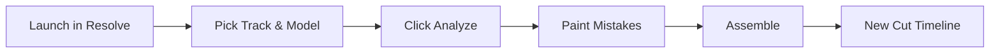

 

### 0.1 Launching from DaVinci Resolve
1. Open your project in **DaVinci Resolve**.
2. In DaVinci Resolve's top application menu bar, navigate to:
   $$\text{\textbf{Workspace}} \longrightarrow \text{\textbf{Scripts}} \longrightarrow \text{\textbf{BadWords}}$$
3. The BadWords window will appear on top of DaVinci Resolve.

 

---

 

### 0.2 Choosing Audio Sources & Model
1. **Timeline Selection:** Confirm your active timeline is selected in the dropdown. (Click `Refresh` if you just created a new timeline).
2. **Track/s Selection:** Select the audio track(s) where dialogue is recorded (e.g., `A1` for your primary microphone).
3. **Language:** Select the spoken language of the recording.
4. **Model:** Leave default (**Large Turbo**) or change to **Large** on high-end hardware or **Medium** on lower-end hardware.

> [!IMPORTANT]  
> **Model Quality Warning:** While smaller models (*Tiny*, *Base*, *Small*) are available in the dropdown, their transcription precision is significantly degraded. Because BadWords relies entirely on verbatim word accuracy to calculate frame-exact cuts, using models below *Medium* can cause the AI to hallucinate or miss words, making the tool practically unusable.
5. Click the green **`Analyze`** button.

  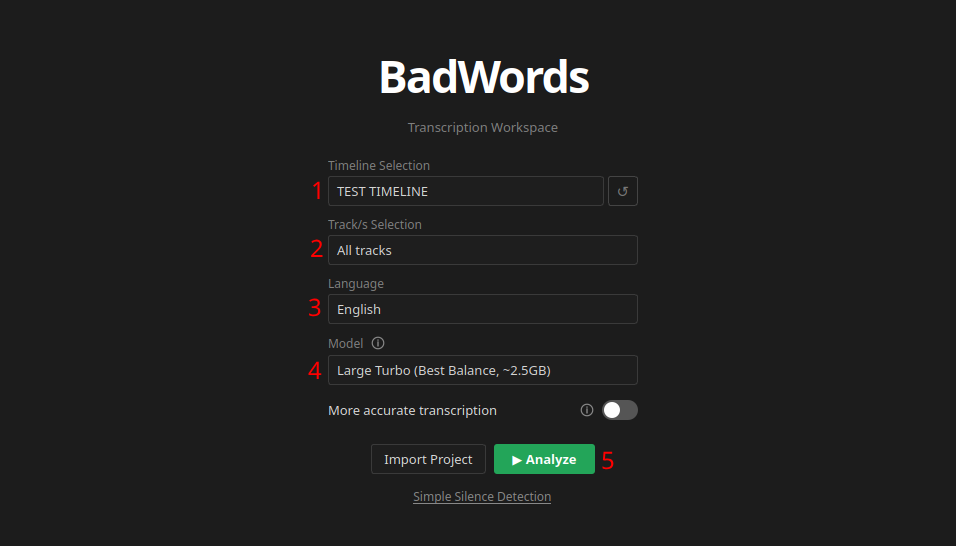

 

---

 

### 0.3 Reviewing, Color-Coding & Cut Settings
1. Once processing finishes, your audio appears formatted as interactive text.
2. Filler words (*"um", "uh", "yyy", "mhm"* etc.) are automatically highlighted in **Red**.
3. Use your mouse to click or drag across mistakes, false starts, or repeated takes:
   - **Press `1` or select Red** for errors and filler words.
   - **Press `2` or select Blue** for retakes and repeated sentences.
   - **Press `4` or select Eraser** to clear any accidental highlight.

  

4. **Silence & Auto-Cut Options in Sidebar:**
   - **Silence Detection Panel:** Choose whether dead air is removed directly (`Cut silence directly`) or highlighted in a light **Tan** color (`Mark silence with color`) so you can adjust cuts manually in Resolve.
   - **Auto-Cut vs Clip Coloring (Assembly Panel):** By default, marked words stay on the timeline as **color-coded clips**. However, if you click the circular **"A" (Auto-cut)** icon next to any color in the *Assembly* panel (it turns green), everything painted with that color will be **ripple-cut (deleted)** during assembly!

  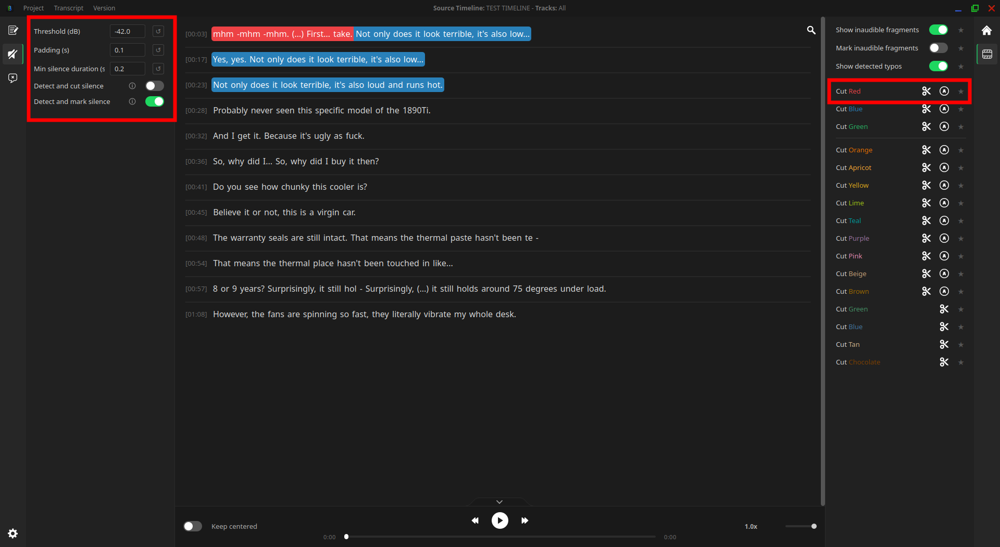

5. Hold **`Ctrl + Left Click`** on any word to instantly jump both BadWords audio and DaVinci Resolve's playhead to that exact timestamp.

 

---

 

### 0.4 Assembling the Cut Timeline
1. When you have finished marking your transcript, click the green **`Assemble`** button in the corner of the main panel on the right.
2. BadWords automatically builds and imports a **brand new timeline** into DaVinci Resolve named `<Timeline-Name> BadWords Edit 1`.
> [!NOTE]
> **100% Non-Destructive:** Your original timeline remains completely untouched. On the new timeline, cuts are applied frame-accurately and every remaining clip is **color-coded directly in DaVinci Resolve (Clip Color)** according to your text markings for instant visual verification.

 

---

 

## 1. Welcome Screen & Source Selection

When BadWords opens, you are greeted by the **Welcome Screen**. This view allows you to configure your transcription pipeline or switch to the ultra-fast standalone silence removal tool.

  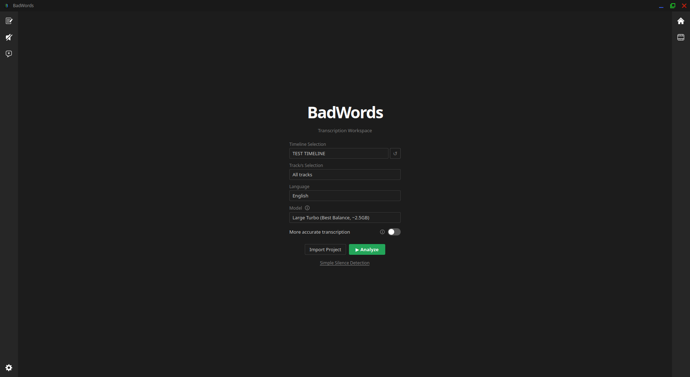

 

### 1.1 Transcription Workspace

| UI Element | Type | Purpose & Description |
| :--- | :--- | :--- |
| **Timeline Selection** | *Dropdown* | Lists all timelines present in your currently open DaVinci Resolve project. Select the timeline you wish to transcribe. |
| **Refresh Timelines `Refresh`** | *Button* | Re-queries DaVinci Resolve's API to update the list of timelines and audio tracks if you created or renamed one while BadWords was open. |
| **Track/s Selection** | *Multi-Select* | Allows you to select one, multiple, or all audio tracks (`A1`, `A2`, etc.).  **Important:** When multiple tracks are selected, BadWords mixes them into a **single combined audio stream** for Whisper. It does *not* transcribe each track separately. If multiple speakers talk over each other on separate tracks, the AI will "hear" mixed overlapping speech. |
| **Language** | *Searchable Dropdown* | Specifies the spoken language of the recording. Selecting a language automatically configures language-specific verbatim acoustic prompts (from a library of 60+ languages) and backend parameters to prevent the AI from translating or smoothing out native hesitation sounds. |
| **Model** | *Dropdown* | Selects the local Faster-Whisper neural network model. *(See the detailed Model Selection Guide below).* |
| **More Accurate Transcription** | *Toggle Switch* | Opens a collapsible slide-out drawer where you can paste or import a reference script (`.txt`, `.pdf`, `.docx`). Keywords from the script are extracted and fed directly into the model's initial prompt, dramatically increasing accuracy on technical jargon, names, and numbers. |
| **Import Project** | *Button* | Opens an existing BadWords `.bws` project file to resume previous editing sessions. |
| **Analyze** | *Action Button* | Extracts audio from Resolve, executes VAD & Whisper acoustic transcription, runs initial silence detection, and opens the main editor. |

#### Model Selection Guide & Hardware Requirements

> [!CAUTION]  
> BadWords relies strictly on **verbatim speech-to-text accuracy** to find acoustic cuts. Models below **Medium** are not recommended for production work as high word error rates degrade the entire cutting workflow.

| Model | Memory (VRAM / RAM) | Disk Space | Speed | Recommended Use Case |
| :--- | :---: | :---: | :---: | :--- |
| **Large Turbo** *(Default)* | ~2.5 GB | ~1.6 GB | Fast & Highly Accurate | **Strongly Recommended.** Best balance of verbatim precision and rendering speed on modern NVIDIA GPUs. |
| **Large (v3)** | ~3.5 GB | ~3.1 GB | Maximum Precision | **Recommended.** Best for heavy accents, technical jargon, or noisy backgrounds. |
| **Medium** | ~2.5 GB | ~1.5 GB | Moderate | Minimum recommended model for lower-spec GPUs or CPU-only setups. |
| **Small** | ~1.0 GB | ~480 MB | Fast | *Legacy / Testing only.* Low verbatim precision on stutters and filler words. |
| **Base** | ~0.5 GB | ~140 MB | Very Fast | *Not recommended.* Prone to hallucinating words and skipping pauses. |
| **Tiny** | ~0.3 GB | ~75 MB | Ultra Fast | *Not recommended.* Only for quick code testing. |

 

---

 

### 1.2 Fast Silence Workspace (Standalone Silence Removal)

Clicking the link **`Simple Silence Detection`** at the bottom of the Welcome Screen flips the interface into **Fast Silence Mode**. This mode bypasses speech-to-text entirely, using light-weight audio normalization and silence analysis to cut dead air across an entire timeline in seconds.

> [!NOTE]  
> **Built-in Audio Normalization:** Unlike DaVinci Resolve's native silence cutter (which requires manually tweaking dB levels for every different audio clip), BadWords **automatically normalizes audio levels in the background** before scanning. This makes the default threshold (`-42.0 dB`) universally accurate across all microphone setups out of the box.

  

#### Fast Silence Controls:
1. **Silence Threshold (dB):** Volume level below which normalized audio is classified as silence.  
   *Default: `-42.0 dB` (Pre-normalized audio ensures this threshold works universally).*
2. **Padding (s):** Safety margin preserved before and after speech to ensure word beginnings and trailing consonants are never clipped.  
   *Default: `0.10s`.*
3. **Min Silence Duration (s):** Minimum pause length required before a cut is triggered.  
   *Default: `0.20s`.*
4. **Mode Toggles (Mutually Exclusive):**
   - **`Cut silence directly`:** Automatically removes silence gaps and ripples the timeline together upon execution.
   - **`Mark silence with color`:** Leaves clips intact but color-codes silent regions with **Tan** clip colors in DaVinci Resolve for manual review.
5. **`Run Detection`:** Executes the pass and instantly builds a **brand new timeline** in DaVinci Resolve (e.g. `<Timeline-Name> BadWords Edit 1`), leaving your source timeline **100% untouched**.

 

---

 

### 1.3 First-Run Model Download & Setup
When you analyze footage with a specific AI model for the first time:
- BadWords automatically downloads the neural network weights from HuggingFace directly into your local installation directory (`models/`).

> [!NOTE]  
> **Initial Download & Animated Progress Bar:**  
> During this one-time download, **the animated progress bar will run in an infinite loop without a percentage counter**, which might make it feel like the process is taking long or stuck. Do not close or force-quit the application! BadWords is actively fetching large neural network files in the background. Depending on your internet connection speed, this process typically takes a few minutes. If a genuine network issue occurs, BadWords will immediately stop and show an error dialog.

- Once downloaded, the model files are saved permanently on your local drive. All subsequent transcriptions with that model run completely offline and start instantly with zero download delay.

 

---

 

## 2. Top Titlebar & Project Management

The top bar of BadWords provides access to file management, transcript exports, and timeline synchronization. Note that these project menus and source details appear only **after the analysis is complete** and the transcript is loaded into the editor.

 

### 2.1 Project Menu
- **Export Project:** Saves the complete state of your current session into a portable `.bws` (BadWords Save) file. This includes the full word-level timestamps, your manual color markings, script comparison data, audio file for audio preview and timeline metadata.
- **Import Project:** Restores an existing session from a `.bws` file.

  

> [!TIP]  
> **Crash Recovery & AutoSave:** BadWords runs a silent background AutoSave engine. If DaVinci Resolve or your system crashes unexpectedly, BadWords detects the cached session on the next launch and prompts you to restore your work with a single click.

 

---

 

### 2.2 Transcript Menu (Export .txt & Clipboard)
- **Export as .txt:** Exports the entire transcript as a clean, formatted plain `.txt` document.
- **Copy to clipboard:** Copies the transcript directly to your system clipboard

  

 

---

 

### 2.3 Versions Dropdown
- **Version Dropdown:** Displays the currently active timeline and all previous versions. Also allowing to switch between them and come back to any previous version. 

> [!TIP]  
> A ***version*** is a save of state of the text and color markings, created every time after clicking **Assemble**

  

 

---

 

### 2.4 Source Timeline & Audio Tracks Info
Located directly in the center of the titlebar, this indicator shows exactly what audio was fed into the AI model during analysis:
- **`Source Timeline:`** The name of the original timeline in DaVinci Resolve that was extracted.
- **`Tracks:`** The specific audio track(s) (e.g. `A1` or `A1, A2`) that Whisper processed.
- **Why it matters:** It serves as a constant reference of truth. If you selected multiple microphone tracks, it reminds you that Whisper analyzed a mixed audio stream of those tracks together. It also identifies which timeline in DaVinci Resolve BadWords will duplicate and cut when you assemble.

  

 

---

 

## 3. Transcript Editor & Sidebar Tools

BadWords operates within an IDE-inspired interface designed for high-efficiency dialogue editing. 

The **central workspace** displays your verbatim speech transcription, where every single word is bound to frame-accurate audio timestamps. Because each word directly represents its corresponding audio slice, selecting, painting, or cutting text performs exact timeline operations on those audio and video segments.

Surrounding the central transcript are modular **Sidebar Panels** containing tools for script alignment, silence trimming, filler word detection, and timeline assembly. These sidebars are fully customizable:
- **Resizable:** Drag sidebar borders to adjust width according to your preference.
- **Draggable:** Freely reorder tabs or drag entire panels between the left and right sides of the window.
- **Collapsible:** Fold and collapse any panel to let the transcript fill more screen space.

> [!NOTE]  
> Switching between open tabs retains your custom resized width. However, completely collapsing and reopening a sidebar panel resets its width back to the default size.

  

 

### 3.1 Words Painting
BadWords uses a ***Color-coded heatmap*** for editing. Selecting a color tool (from the sidebar palette or keys `1`–`4`) and clicking or dragging across words applies that color tag to the corresponding acoustic segment.

For manual editing without a script, you can use these colors however you prefer (for instance, marking all errors in Red and retakes in Blue). However, when using automated tools like **Script Comparison** (see [Section 3.5](#35-script-analysis-sidebar-panel)), BadWords assigns precise semantic meaning to each color:

| Painting Color | DaVinci Clip Color | Meaning in Script Comparison / Recommended Usage |
| :---: | :---: | :--- |
| **Red** | **Violet** | Filler words (*"uh"*, *"um"*, *"yyy"*), obvious stumbles, coughs, and speech errors. |
| **Blue** | **Navy** | Retakes, repeated sentences, false starts, and alternate takes. |
| **Green** | **Olive** | Minor phrasing deviations, typos, or improvisations compared to the script. |
| **Brown** | **Chocolate** | Inaudible speech, mumbled phrases, or microphone clicks. |
| **Eraser** | *Default* | Strips color tags from selected words, restoring standard clip status. |
| **Custom** | *User Assigned* | User-defined custom categories (e.g. "B-Roll", "Zoom In", "Sound Effect"). |

By default, **all marked words remain on your assembled timeline as color-coded clips (DaVinci Clip Color)** so you can inspect them visually before making cuts. To configure automatic ripple cutting or post-review mass removal for specific colors, see [Section 3.8: Assembly & Color Cutting Matrix](#38-assembly-sidebar-panel).

> [!NOTE]  
> **Color Rules & Reserved Presets:**  
> - **Silence Representation:** Silence is not shown as text tokens in the BadWords editor canvas. The **Tan** clip color is applied exclusively on silent cuts inside DaVinci Resolve when you enable `Mark silence with color` in the [Silence Detection Panel](#36-silence-detection-sidebar-panel).
> - **Reserved Colors:** Custom markers cannot use **Green**, **Blue**, **Tan**, or **Chocolate** to prevent visual collisions with native DaVinci clip colors and system states (silence and inaudible audio).

 

---

 

### 3.2 Inaudible Fragments
When audio is completely unintelligible, muffled, or masked by loud background noise, Whisper cannot transcribe speech. BadWords flags these moments as inaudible fragments, represented in the transcript canvas as `(...)` tokens.

  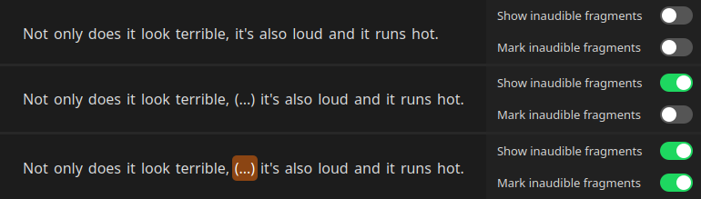

> [!TIP]  
> **Why it matters:** Instead of guessing why a jump or silent gap occurred, this gives you full transparency to see exactly what the AI couldn't parse, allowing you to review those moments manually in Resolve.

You can customize how inaudible tokens are displayed in the editor (hidden, uncolored, or marked with Chocolate color) and how they are handled on the timeline in the [Assembly & Color Cutting Matrix (#3.8)](#38-assembly-sidebar-panel).

 

---

 

### 3.3 Transcript Search Overlay
Pressing **Ctrl + F** (or Cmd + F on macOS) toggles the floating search bar:
- Type any word or phrase to highlight matches across the entire transcript.
- Match counter displays live results (e.g. 4/18).
- Use the **Up / Down Arrow keys** on your keyboard (or click the arrow buttons in the search bar) to cycle through matches.
- Press **Ctrl + F** again (or click the close button) to hide the search bar.

 

---

 

### 3.4 ***Main*** Sidebar Panel 

The **Main Panel** serves as the primary control center for manual word painting and quick assembly actions. It is organized into two sections:

#### Upper Section: Marking Palette & Custom Colors
- **Active Marker Selector:** Radio buttons to switch between **Red**, **Blue**, **Green**, **Eraser**, and custom markers. You can also use the `1`, `2`, `3`, `4` shortcut keys to select these tools.
- **Clear Transcript (Brush Icon):** Erases all color markings across the entire transcript with a confirmation dialog.
- **`+ add custom marker...`:** Opens the Settings dialog directly to create, configure, and assign shortcuts to custom color markers (see [Section 5.4: Custom Markers Tab](#54-custom-markers-tab)).

 

#### Lower Section: Favorites & Timeline Export
- **Analysis Duration Indicator:** Displays exact stats on transcription processing time (e.g. *Analyzed in: 0:48min*).
- **Pinned Favorites:** Dynamically reveals any tools or toggles you have starred with the Star `★` button on the *Assembly* Sidebar Panel (such as one-click auto-cut toggles), letting you control them without leaving the Main tab.
- **`Assemble` Button:** Clicking it triggers the final cut process in DaVinci Resolve. Clicking the arrow button opens the expandable track configuration menu:
  - **Audio Tracks:**
    - **`All tracks`:** Includes every audio track from your source timeline (default).
    - **`Only transcription tracks`:** Includes only the dialogue audio track(s) selected for transcription in the first step.
    - **`Custom selection`:** Lets you manually choose which audio tracks to use.
  - **Video Tracks:**
    - **`All tracks`:** Includes every video track from your source timeline (default).
    - **`No tracks`:** Does not use any video tracks (audio-only assembly).
    - **`Custom selection`:** Lets you manually choose which video tracks to use.

 

 

---

 

### 3.5 ***Script Analysis*** Sidebar Panel 

The **Script Analysis Panel** houses intelligent alignment tools that automatically detect speech errors and retakes, either by comparing the recording against an imported script or by finding acoustic repetitions in unscripted takes.

  

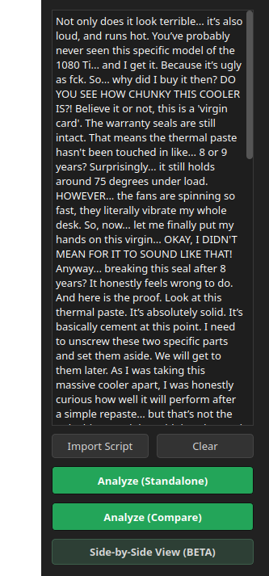

#### Available Tools & Modes:
- **Script Input Area & `Import Script`:** Paste your text or load `.txt`, `.docx`, or `.pdf` files. BadWords automatically strips formatting and normalizes whitespace.
- **`Analyze (Standalone)`:** Scans the raw transcript *without* a script using a lightweight repetition detection algorithm to spot repeated phrases and false starts, marking earlier discarded takes in **Blue**. *(Note: This feature is under active development and currently serves as a quick helper to highlight potential retake zones in long transcripts for manual inspection).*
- **`Analyze (Compare)`:** A proprietary, custom-built sequence alignment algorithm developed specifically for BadWords. Powered by advanced dynamic programming techniques inspired by bioinformatic DNA sequence alignment, it provides rock-solid, dependable script matching. It compares your recording against the imported text and color-codes deviations:
  - Words matching the script remain unpainted.
  - Repeated attempts and retakes are painted **Blue**.
  - Filler words, stumbles, and speech errors are painted **Red**.
  - Minor phrasing variations and slight mishearings compared to the script are painted **Green** (these green typo tags can be toggled on/off anytime using `Show detected typos` in the [Assembly Panel](#38-assembly-sidebar-panel)).
- **`Side-by-Side View (BETA)`:** Opens the two-column comparative view (shown in the screenshot above) with the reference script on the left and the live transcript on the right, highlighting unspoken lines, skipped phrases, and improvisations.
- **`Return to Normal View`:** To exit the Side-by-Side view at any time, open the Script Analysis sidebar tab and click this button to restore the standard transcript editor canvas.

> [!TIP]  
> Use **Analyze (Compare)** when you have a prepared script, and **Analyze (Standalone)** when editing unscripted recordings to quickly highlight repeated takes.

 

 

---

 

### 3.6 ***Silence Detection*** Sidebar Panel 

The **Silence Detection Panel** allows you to fine-tune acoustic silence trimming applied after full speech transcription, removing awkward pauses and dead air.

#### Detection Parameters:
- **Threshold (dB):** Volume floor in decibels (default `-42.0 dB`). Audio below this level is classified as silence. Click `↺` to reset.
- **Padding (s):** Preserves safety margins around speech (default `0.10s`) so the start and end of spoken words are never clipped. Click `↺` to reset.
- **Min Silence Duration (s):** Minimum pause length required to trigger a cut (default `0.20s`). Click `↺` to reset.

#### Silence Actions:
- **`Detect and cut silence` Toggle:** Automatically ripple-deletes silent gaps during timeline assembly.
- **`Detect and mark silence` Toggle:** Retains silent gaps on the timeline but tags them with the **Tan** clip color in DaVinci Resolve for manual inspection.

> [!NOTE]  
> BadWords automatically normalizes audio volume prior to silence detection, making the default parameters effective and consistent across different microphones and environments.

> [!TIP]  
> If you want to remove silence from an entire timeline instantly without transcribing speech, use the **Fast Silence Workspace** on the Welcome Screen (see [Section 1.2: Fast Silence Workspace](#12-fast-silence-workspace-standalone-silence-removal)).

 

---

 

### 3.7 ***Filler Words*** Sidebar Panel 

The **Filler Words Panel** manages BadWords' built-in dictionary for identifying hesitation sounds (*"uh"*, *"um"*, *"yyy"*, *"mhm"*, *"like"*).

#### Dictionary & Automation Controls:
- **Inline Words Editor:** Edit the list of comma-separated filler words directly.
- **`Save` & `↺` (Reset):** Save custom dictionary edits or revert to the factory default list.
- **`Mark filler words automatically` Toggle:** When enabled, any word in your transcript matching the dictionary is automatically painted **Red** right as transcription finishes.

> [!TIP]  
> Enable **Auto-Cut** for **Red** markers in the [Assembly Panel](#38-assembly-sidebar-panel) to automatically ripple-delete all detected filler words when you click **Assemble**.

 

---

 

### 3.8 ***Assembly*** Sidebar Panel 

The **Assembly Panel** allows you to configure global display toggles and choose how each marker color is handled during timeline assembly or cut immediately from an active timeline.

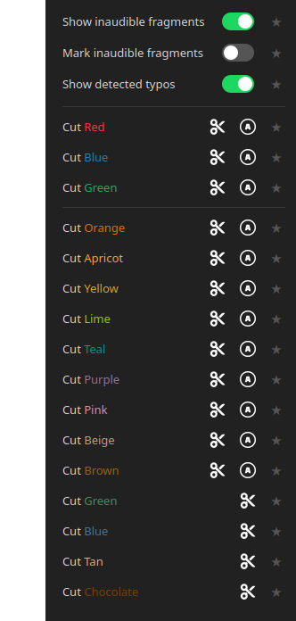

#### Global Inaudible & Typos Toggles:
- **`Show inaudible fragments`:** Controls how inaudible `(...)` tokens behave in the transcript canvas (see [Section 3.2](#32-inaudible-fragments)):
  1. **Hidden:** When toggled OFF, inaudible tokens are completely hidden and their duration is smoothly absorbed by surrounding words and color blocks.
  2. **Visible (Uncolored):** When toggled ON (without color marking), tokens appear as plain text `(...)` and assemble as standard uncolored clips in DaVinci Resolve.
  3. **Marked with Chocolate Color:** When `Mark inaudible with color` is also toggled ON, inaudible tokens turn brown in the editor and are color-coded as **Chocolate** clips in DaVinci Resolve upon assembly for visual review.
- **`Show detected typos`:** Toggles whether minor phrasing deviations detected by Script Comparison are highlighted in **Green** or left unpainted.

#### Controls per Color Row:
1. **Scissors Icon (`Cut Now`):** Prompts you to immediately cut and remove all clips of this color from either the **Currently Selected Timeline** or a **New Timeline** in DaVinci Resolve (leaving your source timeline intact). This allows you to assemble your timeline with colors intact for visual review, and then mass-delete specific colors in one click after verification.
2. **Auto-Cut Icon (Circle "A"):** When active (green), any text painted with this color is **automatically ripple-deleted** during the standard `Assemble` process.  
   *(Note: Auto-Cut "A" is available for all standard and custom marker colors. Native Resolve system colors like Green, Blue, Tan for silence, and Chocolate for inaudibles provide the Scissors Cut Now action).*
3. **Star Icon (`★`):** Pins selected option directly onto the Main Panel under *Pinned Favorites*.

 

 

---

 

## 4. Audio Preview & Navigation Bar

The bottom panel of the editor houses the **Audio Preview Bar**, eliminating guesswork by allowing you to listen to words and navigate Resolve directly from the text.

  

### 4.1 Jump to Word
- **Shortcut:** **`Ctrl + Left Click`** (Configurable in Settings to `Alt` or `Shift` + Left/Right click).
- Clicking any word in the transcript instantly moves **both**:
  1. The internal BadWords audio playback head.
  2. The **DaVinci Resolve timeline playhead** to the exact frame where the word was spoken!

 

---

 

### 4.2 Integrated Audio Player Controls
- **Play / Pause:** Click the animated play button or press **`Space`**.
- **Seeker Bar (JumpSlider):** Click anywhere on the progress bar to scrub through the audio.
- **Skip Backward / Forward:** Press **`Left Arrow`** / **`Right Arrow`** to jump in 2-second increments.
- **Speed Adjustment:** Click the speed dropdown to select playback rates (`0.5x`, `0.75x`, `1.0x`, `1.25x`, `1.5x`, or `2.0x`). Pitch correction is applied automatically to maintain vocal clarity at high speeds.
- **Toggle Floating Tab:** Click the floating island tab at the bottom of the editor to hide or show the audio bar.

 

---

 

## 5. Settings & Preferences 

Clicking the Gear icon in the bottom-left corner of the window (or pressing **`Escape`**) opens the **Settings Dialog**. The dialog allows you to toggle between **Basic View** (which presents a clean set of essential settings sufficient for the vast majority of workflows) and **Advanced View** (which expands specific tabs with more parameters and unlocks the dedicated AI Engine tab).

  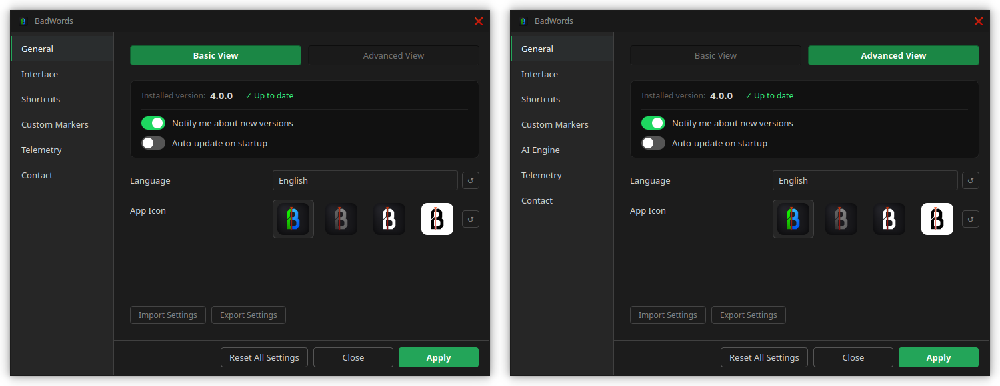

> [!NOTE]
> The screenshots below showcase the complete settings layout, while options available exclusively in **Advanced View** are explicitly marked with a note.

 

---

 

### 5.1 ***General*** Tab

The **General** tab allows you to configure core application settings, including UI language, app icon, automatic update checks, and configuration backup.

  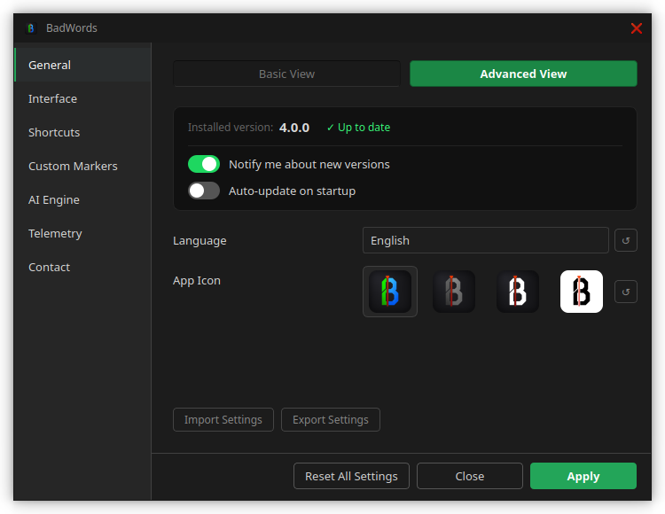

**Updates & Version Card:**
- Displays your currently installed version and checks for updates automatically.
- **`Update Now` Button:** Appears whenever a new patch or version is released on GitHub, allowing you to update in one click.
- **`Check for updates on startup` Toggle:** Automatically checks remote repositories for new releases on launch.
- **`Auto-update on startup` Toggle:** Automatically downloads and installs new releases in the background upon launch. Due to DaVinci Resolve script runtime constraints, newly installed updates take effect on the next application launch (simply close and reopen BadWords to use the new version).

**Language (`Language`):**
- Switches the entire BadWords user interface between supported languages: English, Polish, German, Spanish, French, Italian, Portuguese, Dutch, Ukrainian, and Russian.

**App Icon Style:**
- Choose between 4 distinct window icon designs (**Default**, **Monochrome**, **White B**, **White**) to match your system theme.

**Settings Backup:**
- **`Import Settings` / `Export Settings`:** Exports or restores your preferences via a `.json` backup file to migrate configurations between computers.

 

---

 

### 5.2 ***Interface*** Tab

The **Interface** tab lets you customize how your transcript looks and behaves, adjust font scaling and line spacing, and control synchronization with DaVinci Resolve.

> [!NOTE]  
> The **`Always on Top`** toggle and the **Chunk Segmentation Parameters** (`Max Chunk Words`, `Chunk Lookahead`, `Min Chunk Characters`) are visible only when **Advanced View** is enabled.

  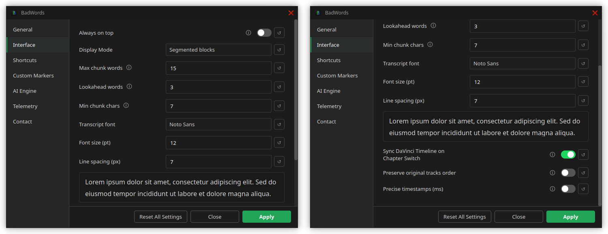

**`Always on Top` Toggle:**
- Forces BadWords to float permanently above DaVinci Resolve and other windows.

**Display Mode:**
- **`Segmented Blocks`:** Groups sentences into structured dialogue blocks with timestamp headers `[00:14]` for easy skimming.
- **`Continuous Flow`:** Displays transcription as one continuous text block (paragraph).

**Chunk Segmentation Parameters (for Segmented Mode):**  
*(In Segmented Blocks mode, a "chunk" represents a single displayed line/block of dialogue with its own timestamp header).*
- **Max Chunk Words (default `30`):** Target maximum number of words per block before attempting a line break.
- **Chunk Lookahead (default `3`):** Number of additional words the engine searches past `Max Chunk Words` to find a natural punctuation mark (`.`, `?`, `!`, `,`). If punctuation is found within this window, the chunk is extended up to that punctuation mark (making the effective maximum word count `33` instead of `30`).
- **Min Chunk Characters (default `7`):** Minimum character count threshold before a new chunk is permitted.

> [!NOTE]  
> **Known Behavior & Re-analysis Requirement:**  
> - **Initial Default Value:** In current releases, the backend initializes with an internal default of `15` words per chunk under the hood, even though the UI input box displays `30`. Explicitly changing the value in Settings will properly overwrite and save your custom choice.
> - **Re-analysis Required:** Dialogue segmentation into blocks is computed exclusively during transcription. If you adjust any Chunk Segmentation parameters in Settings, you must **re-run transcription (`Analyze`)** on your audio to see the updated chunk lengths reflected in the transcript canvas.

**Transcript Typography:**
- **Font Family:** Select any font installed on your operating system.
- **Font Size (pt):** Adjust text scale (8pt to 48pt).
- **Line Spacing (px):** Adjust vertical padding between lines of text.
- **Live Preview Box:** Instantly previews typography and line height adjustments before applying.

**DaVinci Resolve Synchronization:**
- **`Sync DaVinci Timeline on Chapter Switch` Toggle:** When switching between project versions in BadWords (via the top titlebar Versions dropdown: [Section 2.3: Versions Dropdown](#23-versions-dropdown)), DaVinci Resolve automatically switches its active timeline view to the timeline assembled for that version. If disabled, Resolve's timeline view does not change when switching versions in BadWords.
- **`Preserve original track order` Toggle:** Maintains the exact source track numbers in DaVinci Resolve. For example, if you assemble only audio track `A2`, by default Resolve places it onto `A1`; with this option enabled, it remains strictly on original `A2` (leaving `A1` empty). Applies to both audio and video tracks.
- **`Precise Timestamps` Toggle:** Switches timestamps from rounded seconds (e.g. **[01:08]**) to full millisecond precision (e.g. **[01:08.432]**).

 

---

 

### 5.3 ***Shortcuts*** Tab

The **Shortcuts** tab enables you to customize keyboard and mouse bindings for word painting, playback controls, navigation, and search.

> [!NOTE]  
> The key capture inputs automatically detect duplicate shortcut assignments across tools and will highlight conflicting inputs with a **Red** border.

  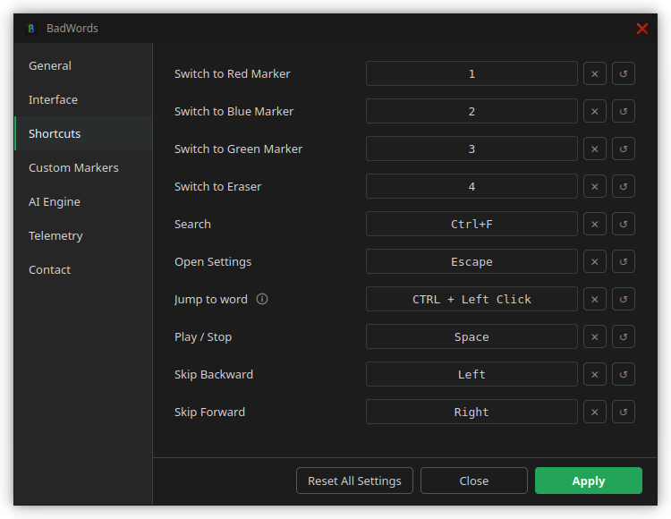

**Color Marker Keys:**
- Assign custom keybindings to **Red (`1`)**, **Blue (`2`)**, **Green (`3`)**, **Eraser (`4`)**, and any custom markers you create.

> [!NOTE]  
> Newly created custom markers do not receive a shortcut key by default and must be manually assigned here.

**Navigation & Editing Controls:**
- **Jump to Word:** Configure mouse click combination (`Ctrl`/`Alt`/`Shift` + `Left Click` or `Right Click`).
- **Play / Pause:** Default `Space`.
- **Skip Backward / Forward:** Default `Left Arrow` / `Right Arrow` (2-second jumps).
- **Search Overlay:** Default `Ctrl + F`.
- **Open Settings:** Default `Escape`.

**Reset & Clear Controls:**
- Use the **`↺`** and **`✕`** buttons to clear a binding or revert individual shortcuts back to default.

 

---

 

### 5.4 ***Custom Markers*** Tab

The **Custom Markers** tab allows you to create, organize, and reorder custom color markers mapped to DaVinci Resolve clip colors for specialized workflows.

  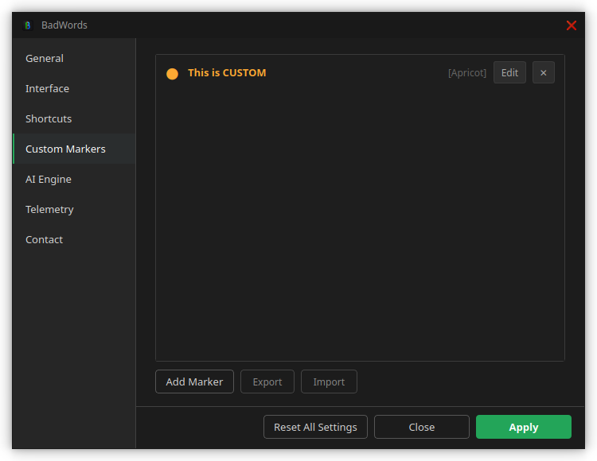

**Custom Marker List:**
- Drag-and-drop handles allow you to freely reorder marker priority and display sequence in the editor palette.

**`Add Marker`:**
- Adds a new marker by setting its custom name and choosing an available clip color from the dropdown list.

**`Export Markers` / `Import Markers`:**
- Save your custom markers bundle as a portable preset.

 

---

 

### 5.5 ***AI Engine*** Tab

The **AI Engine** tab provides deep control over neural speech recognition, hardware acceleration (GPU/CPU), and acoustic Whisper inference parameters.

> [!NOTE]  
> The **AI Engine Tab** is unlocked exclusively in **Advanced View** for users who want complete control over neural network inference and Faster-Whisper decoding behavior.

  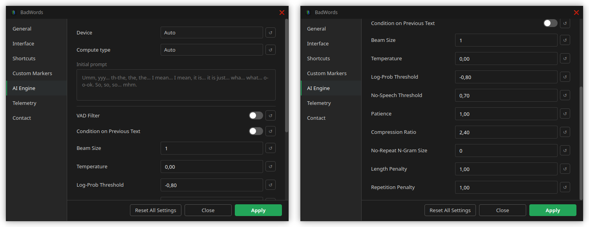

**Hardware & Precision:**
- **Device (`Auto`, `GPU`, `CPU`):** Selects whether AI transcription executes on dedicated GPU hardware or system CPU.

> [!NOTE]  
> When set to **Auto** and no GPU is found, the application will fall back to CPU. **ONLY NVIDIA GPU's are supported**

- **Compute Type (`Auto`, `float16`, `int8`, `float32`, `int8_float16`, `int8_float32`):** Selects neural quantization precision. `int8_float16` is fastest on modern GPUs; `int8` saves RAM and runs on CPU but reduces precision.

**Acoustic Guidance:**
- **Initial Prompt:** Custom text prompt fed directly into Whisper before transcription. Pre-loaded with BadWords' *Golden Verbatim* prompt tailored to each language to prevent AI hallucination and ensure accurate capture of filler phonemes and stutters.

**Deep Inference Thresholds:**
- **VAD Filter (Voice Activity Detection):** Pre-filters non-speech audio using Silero VAD before feeding chunks to Whisper.
- **Condition on Previous Text (default `False`):** When disabled, prevents Whisper from entering infinite repetition loops on acoustic noise.
- **Beam Size (default `1`):** Beam search width. `1` provides fastest greedy decoding.
- **Temperature (default `0.0`):** Randomness sampling. `0.0` ensures 100% deterministic transcription.
- **Logprob Threshold (default `-0.8`):** Confidence floor for acoustic tokens.
- **No Speech Threshold (default `0.7`):** Probability boundary to classify segment as silence.
- **Patience, Compression Ratio, No-repeat N-gram, Length & Repetition Penalties:** Precision tuning for edge-case speech models.

 

---

 

### 5.6 ***Telemetry*** Tab

The **Telemetry** tab allows you to review or modify the diagnostic and privacy choices you selected in the initial first-run popup, and provides direct links to community resources.

  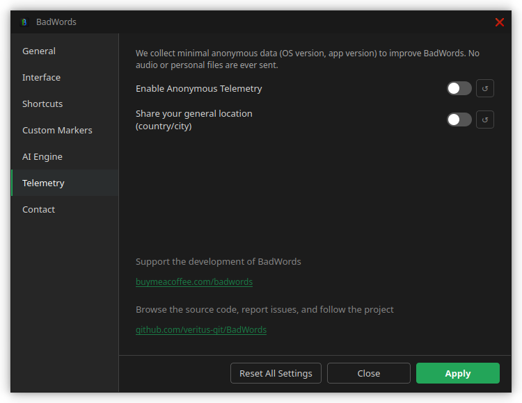

**Privacy & Diagnostic Settings:**
- **`Anonymous Telemetry` Toggle:** 100% anonymous ping containing only your OS type and BadWords version number (used solely to gauge active platform usage). **No audio, speech, transcripts, or personal data are ever collected.**
- **`Include Geographic Region` Toggle:** Optionally includes approximate location (country-level) with anonymous usage pings.

**Community Links:**
- Direct buttons to support BadWords on *Buy Me a Coffee* or visit the official *GitHub repository*.

 

---

 

### 5.7 ***Contact*** Tab

The **Contact** tab lets you locate local debug log files for troubleshooting and submit diagnostic support tickets directly to the developer.

> [!NOTE]
> yes I know the naming of this tab is super non-intuitive, I'll fix it in the next updates... (maybe)

  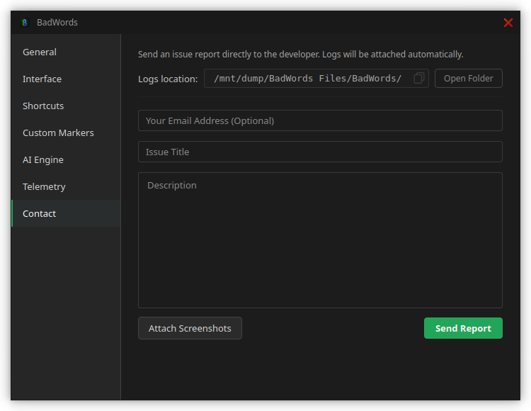

**Debug Logs:**
- **Logs Location & One-Click Copy:** Displays the absolute path to your `badwords_debug.log` file with a copy button for easy troubleshooting.

**Direct Support Ticket Form:**
- Enter a problem title and detailed description.
- Optionally provide your email address if you would like to receive a direct reply from the developer.
- Attach relevant screenshots to illustrate the issue.
- Error logs (`badwords_debug.log`) are bundled and attached automatically.
- Click **`Send Report`** to transmit the diagnostic ticket directly to the developer.

 

---

 

> [!NOTE]  
> **Documentation in Active Development:** This user manual is actively being updated and expanded. Additional step-by-step practical workflows, editing recipes, and detailed FAQs will be added in upcoming documentation updates!

 

  <b>BadWords - Cleaner Timelines, Faster.</b> 
  <i>Developed by Szymon Wolarz • Licensed under the MIT License</i>

